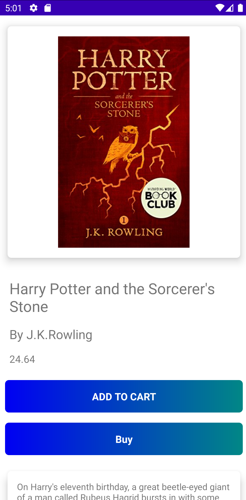

<table style="width:100%">
  <tr>
    <td>

## Shop Pal 🛒

 E-Commerce Android app built with Kotlin, Firebase, Room and MVC.

    
    
    
    

### The purpose of this repository

- A fully functional E-Commerce Android app built with Kotlin, Firebase and Room Database.
- Follows Android design and development best practices with MVC
- Explore the possibilities of creating a realtime application with complex UI and UX.

### Status: 👨‍💻 In progress

ShopPal is under active development.

</td> 
<td>

  
</td>
</tr>
</table>

### Stack

| Tools & Libraries| Link |
|     :---      |          :---: |
| 🤖 Kotlin | [Kotlin](https://kotlinlang.org) |](https://developer.android.com/jetpack/compose) |
| Firebase Authentication  | [Authentication](https://firebase.google.com/products/auth) |
|  Firebase Cloud Firestore | [Cloud Database](https://firebase.google.com/products/firestore) |
|  Firebase Realtime Database | [Realtime Database](https://firebase.google.com/products/realtime-database) |
| Firebase Cloud Storage  | [Cloud Stroage](https://firebase.google.com/products/storage) |
| Room | [Database](https://developer.android.com/training/data-storage/room) |
| Navigation component | [Nav Graph](https://developer.android.com/guide/navigation/navigation-getting-started) |
| Glide | [Glide](https://github.com/bumptech/glide) |
| Gson | [GSon](https://github.com/google/gson) |

## 📷 Screenshots

<table style="width:100%">
  <tr>
    <th>Splash Screen</th>
    <th>Login</th> 
    <th>Registration</th>
    <th>Password Reset</th>
  </tr>
  <tr>
    <td></td> 
    <td></td>
    <td></td> 
    <td></td>
  </tr>
  <tr>
    <th>User Info Edit</th>
    <th>Dashboard</th>
    <th>Product Details</th>
    <th>Cart</th>
  </tr>
  <tr>
    <td></td>
    <td></td>
    <td></td>
    <td></td>
  </tr>
  <tr>
    <th>Cart</th>
    <th>Address</th> 
    <th>Delivery Details</th>
    <th>Checkout</th>
  </tr>
  <tr>
    <td></td> 
    <td></td>
    <td></td> 
    <td></td>
  </tr>
  <tr>
    <th>Order Status</th>
    <th>Ordered Item Info</th>
    <th>User Settings</th>
  </tr>
  <tr>
    <td></td>
    <td></td>
    <td></td>
  </tr>
</table>

 ## Package Structure
 
    com.example.shoppal                # Root Package
      .
      ├── activities                   # Contains various activities to login, register, add address, select address, implement cart functionality, checkout order, view shopping items, reset password, view details of the item, show status of the order, view/edit profile details and logout.
      ├── adapters                     # Contains adapters to manage the flow of the application.
      ├── firebase                     # Implements firebase authentication, firebase cloud firestore, firebase realtime database and firebase storage.  
      ├── fragments                    # Contains CartFragment, OrdersFragment and ShoppingItemsFragment to implement cart functionality, display status of orders and display shopping items.
      ├── interfaces                   # Has interface which contains setUserDetails method.
      ├── models                       # Contains various model classes to implement business layer of the application.
      ├── room                         # Implements room persistence library related logic.
      └── utils                        # Contains Constants/Tags
      

[<a href="#top">Back to top</a>]

